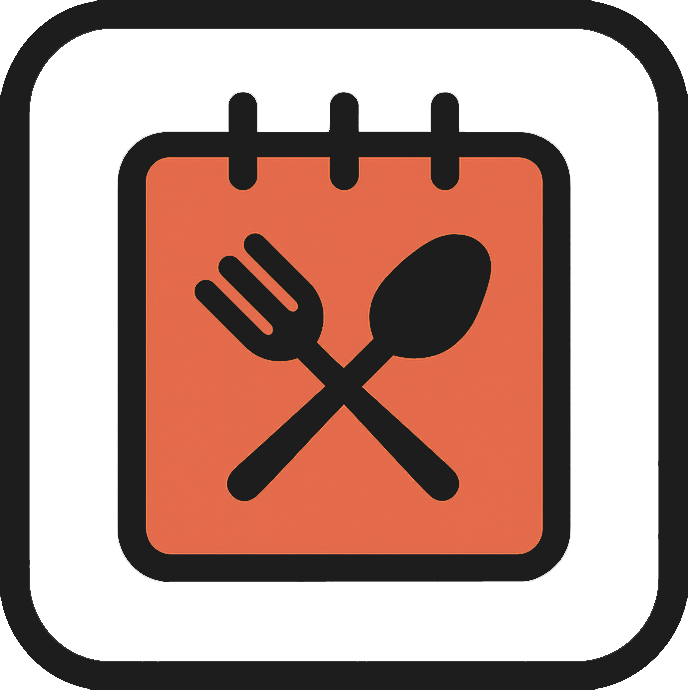
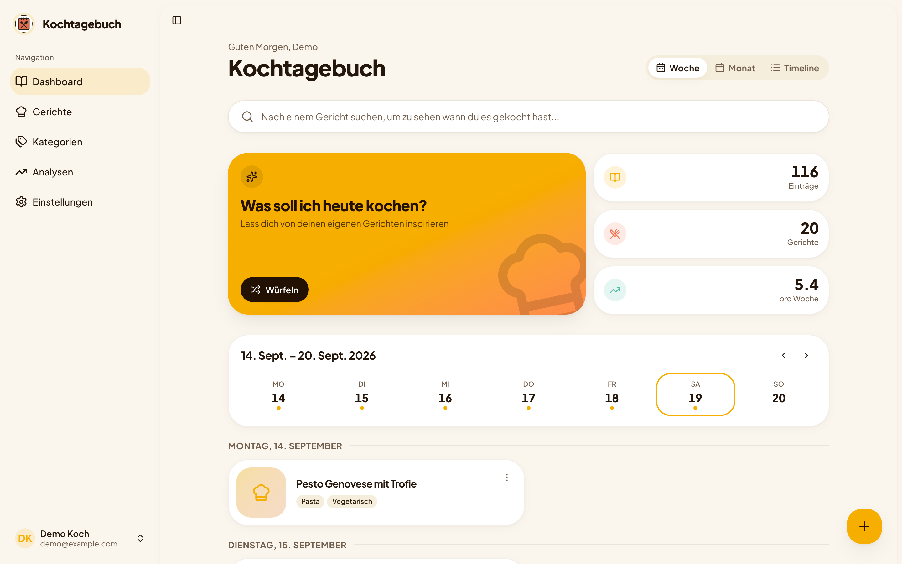
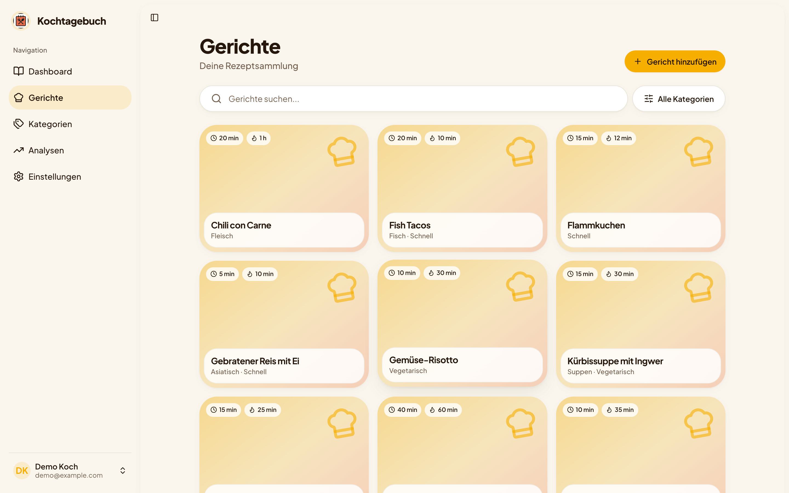
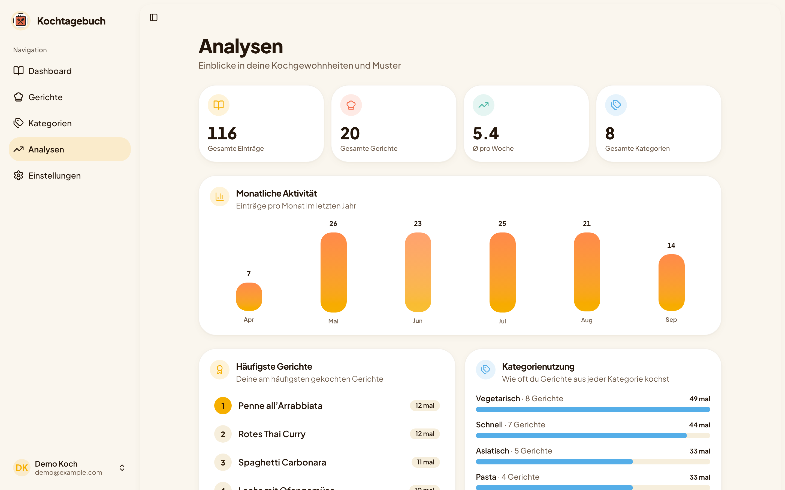
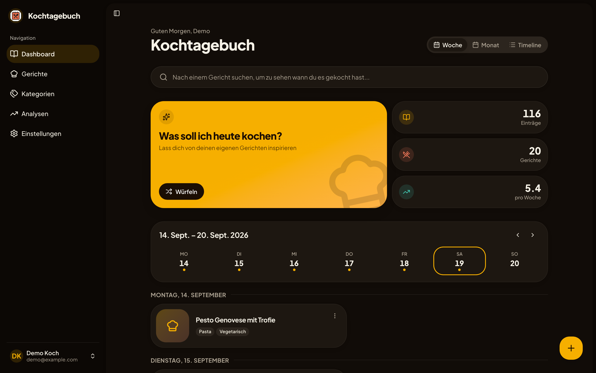
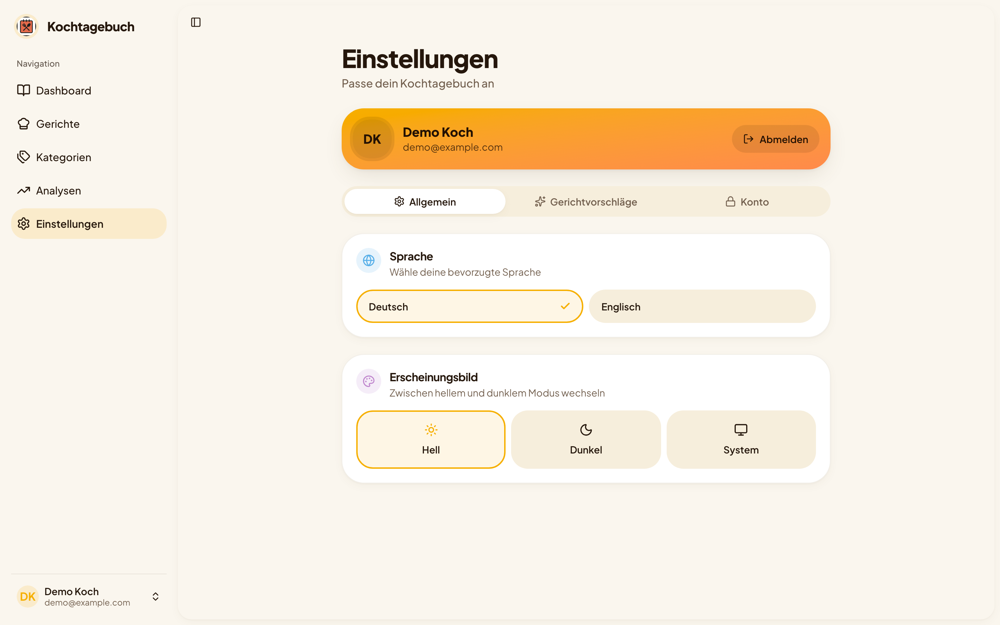
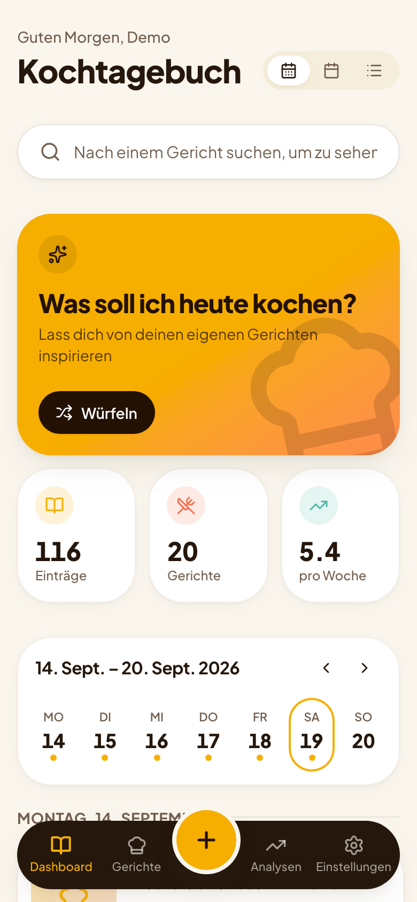
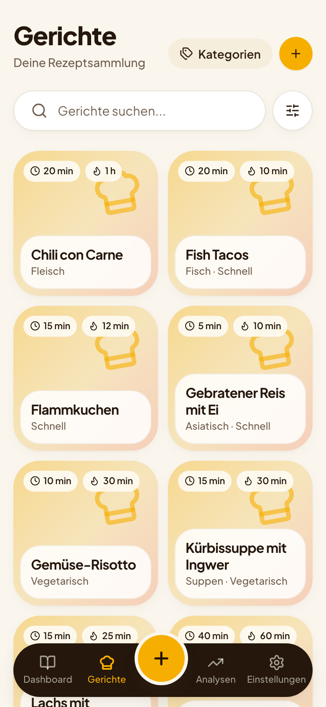
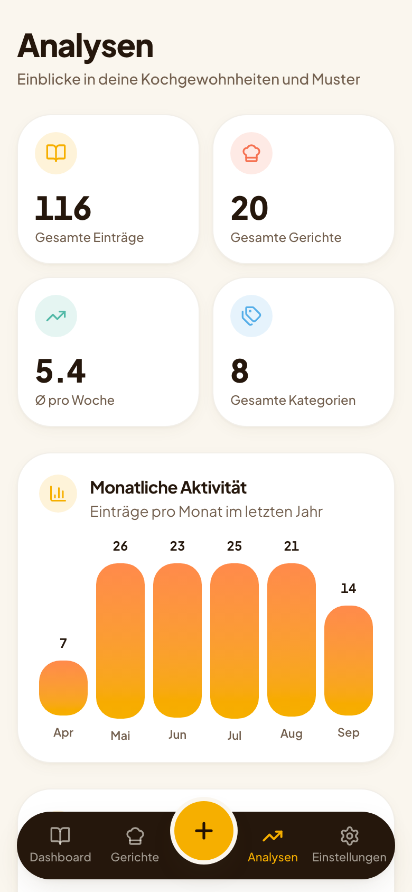

<div align="center">

<p align="center">
  
</p>

<h1 align="center">Cooking Diary</h1>

**Remember what you cooked. Stop asking "what should we eat today?".**

A self-hosted cooking diary: log every meal you cook, see your habits at a glance,
and let your own history suggest what's next.

[](https://github.com/p-arndt/cooking-diary/actions/workflows/release.yml)
[](https://github.com/p-arndt/cooking-diary/releases)
[](https://svelte.dev)
[](compose.yaml)
[](https://github.com/p-arndt/cooking-diary/pkgs/container/cooking-diary)
[](mobile/README.md)

[Features](#-features) · [Screenshots](#-screenshots) · [Quickstart](#-quickstart) · [Configuration](#%EF%B8%8F-configuration) · [Development](#%EF%B8%8F-development) · [Mobile app](#-mobile-app)

</div>

---

<p align="center">
  
</p>

<sub>All screenshots show the seed data (`pnpm db:seed`) and are captured by
[scripts/screenshots.ts](scripts/screenshots.ts). The UI speaks English and German.</sub>

## ✨ Features

<table>
<tr>
<td width="50%" valign="top">

### 📖 Diary

Log when you cooked what, with notes and photos. Browse your history by
**week**, **month** or as a **timeline**, and search for a meal to see
every time you made it.

</td>
<td width="50%" valign="top">

### 🍝 Meal library

Your own recipe collection with photos, prep and cook time, difficulty and
categories like _Pasta_, _Vegan_ or _Quick_. Search and filter in one place.

</td>
</tr>
<tr>
<td width="50%" valign="top">

### 🎲 "What should I cook today?"

One tap rolls a suggestion from **your** history: it skips what you had
recently, leans on what you usually cook on that weekday, and leaves out
categories you don't want.

</td>
<td width="50%" valign="top">

### 📊 Analytics

Entries per month, favourite meals, most active weekdays and how your
categories stack up. Find out that it really is pasta again.

</td>
</tr>
<tr>
<td width="50%" valign="top">

### 🔐 Accounts

Email and password login with [Better Auth](https://better-auth.com),
password reset by mail, personal settings per user.

</td>
<td width="50%" valign="top">

### 📱 Everywhere

Installable PWA, light and dark theme, English and German, plus a native
[Android and iOS app](#-mobile-app) on the same JSON API.

</td>
</tr>
</table>

## 📸 Screenshots

<table>
<tr>
<td width="50%" valign="top">
  <br>
  <sub><b>Meal library</b>: times, categories, search and filter.</sub>
</td>
<td width="50%" valign="top">
  <br>
  <sub><b>Analytics</b>: what you cook, how often, and when.</sub>
</td>
</tr>
<tr>
<td width="50%" valign="top">
  <br>
  <sub><b>Dark mode</b>: follows the system or your choice in the settings.</sub>
</td>
<td width="50%" valign="top">
  <br>
  <sub><b>Settings</b>: tune the suggestions, language and theme.</sub>
</td>
</tr>
</table>

<p align="center">
  
  &nbsp;
  
  &nbsp;
  
</p>

<p align="center"><sub>On a phone, with the bottom tab bar and the quick-add button.</sub></p>

## 🚀 Quickstart

### Docker

Every release is published as `ghcr.io/p-arndt/cooking-diary`. The app runs its database
migrations on start, so all it needs is a Postgres:

```yaml
# compose.yaml
services:
  app:
    image: ghcr.io/p-arndt/cooking-diary:latest
    restart: unless-stopped
    ports:
      - 3000:3000
    env_file: .env
    environment:
      POSTGRES_HOST: postgres
    volumes:
      - files:/app/files # uploaded photos
    depends_on:
      - postgres

  postgres:
    image: postgres:17
    restart: unless-stopped
    env_file: .env
    volumes:
      - pgdata:/var/lib/postgresql

volumes:
  files:
  pgdata:
```

Fill in a `.env` (see [Configuration](#%EF%B8%8F-configuration)), run `docker compose up -d`
and open **<http://localhost:3000>**.

### From source

```bash
git clone https://github.com/p-arndt/cooking-diary.git
cd cooking-diary
cp .env.example .env
pnpm install
pnpm db:start        # Postgres via docker compose
pnpm db:seed         # optional: demo@example.com / demo1234 with 150 days of history
pnpm dev             # http://localhost:5173
```

Re-running `pnpm db:seed` resets only the demo user's data.

## ⚙️ Configuration

Everything is configured through environment variables, usually a `.env` file.

| Variable             | What it controls            | Example                 |
| -------------------- | --------------------------- | ----------------------- |
| `BETTER_AUTH_SECRET` | Secret for signing sessions | `openssl rand -hex 32`  |
| `BETTER_AUTH_URL`    | Public URL of your instance | `http://localhost:3000` |
| `POSTGRES_HOST`      | Database host               | `localhost`             |
| `POSTGRES_PORT`      | Database port               | `5432`                  |
| `POSTGRES_USER`      | Database user               | `cooking_diary`         |
| `POSTGRES_PASSWORD`  | Database password           | `change-me`             |
| `POSTGRES_DB`        | Database name               | `cooking_diary`         |

<details>
<summary><b>SMTP for password reset mails</b> (optional)</summary>

| Variable                      | Purpose                 | Example               |
| ----------------------------- | ----------------------- | --------------------- |
| `SMTP_HOST`                   | SMTP server             | `smtp.example.com`    |
| `SMTP_PORT`                   | SMTP port (default 587) | `587`                 |
| `SMTP_USER` / `SMTP_USERNAME` | Login name              | `you@example.com`     |
| `SMTP_PASSWORD`               | Password                | `your-smtp-password`  |
| `SMTP_FROM`                   | Sender address          | `noreply@example.com` |

Without SMTP the reset link is written to the server log instead.

</details>

## 🛠️ Development

| Command               | What it does                                                       |
| --------------------- | ------------------------------------------------------------------ |
| `pnpm dev`            | Dev server on <http://localhost:5173>                              |
| `pnpm build`          | Production build (adapter-node)                                    |
| `pnpm check`          | Type check with svelte-check                                       |
| `pnpm lint`           | Prettier and ESLint                                                |
| `pnpm test:unit`      | Unit tests (Vitest)                                                |
| `pnpm db:generate`    | Generate a migration from the Drizzle schema                       |
| `pnpm db:migrate`     | Apply migrations                                                   |
| `pnpm db:studio`      | Open Drizzle Studio                                                |
| `pnpm db:seed`        | Reset the demo user with sample data                               |
| `pnpm screenshots`    | Recapture the README screenshots (seeded instance must be running) |
| `just ci`             | Everything CI would run                                            |
| `just release <bump>` | Cut a release with [stamp](https://github.com/p-arndt/stamp)       |

**Stack:** [SvelteKit](https://svelte.dev) with Svelte 5 runes · PostgreSQL with
[Drizzle ORM](https://orm.drizzle.team) · [Better Auth](https://better-auth.com) ·
Tailwind CSS and [shadcn-svelte](https://shadcn-svelte.com) ·
[LayerChart](https://layerchart.com) · [Paraglide](https://inlang.com/m/gerre34r/library-inlang-paraglideJs)
for i18n · Nodemailer.

## 📱 Mobile app

[`mobile/`](mobile/README.md) holds a native Android and iOS client built with Kotlin and
Compose Multiplatform. It talks to the same server through the `/api/v1` JSON API with
bearer tokens and uses the same accounts as the web app. `just mobile` lists its recipes.

## 🤝 Contributing

Issues and pull requests are welcome. Open an issue first for bigger changes, keep PRs
focused, add tests for new behaviour and run `pnpm format` before pushing.
